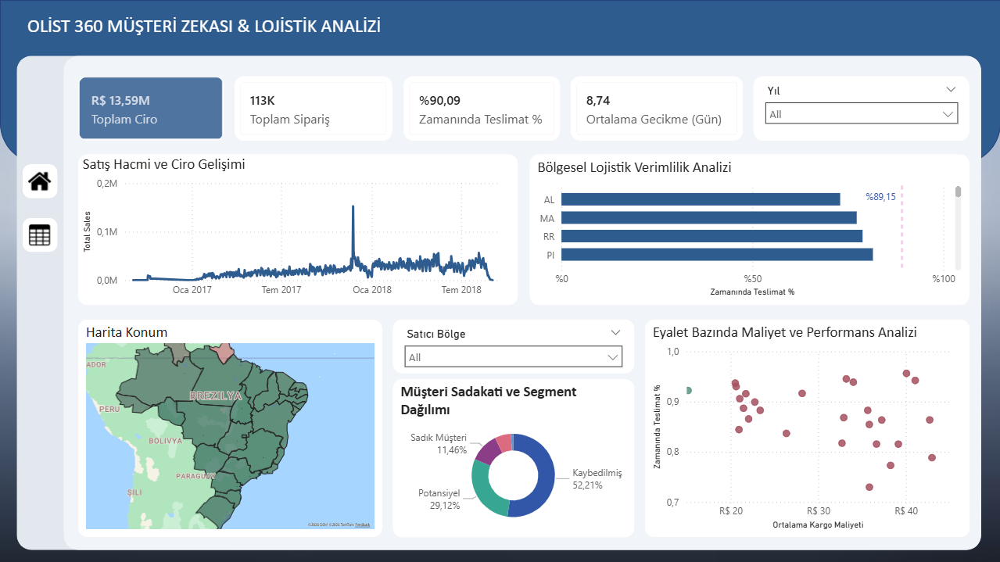
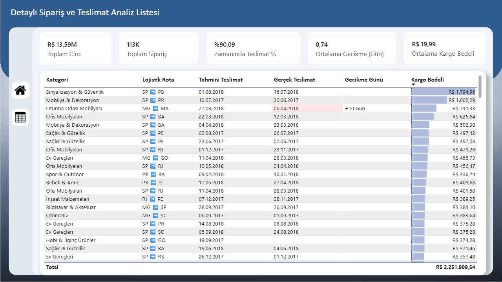
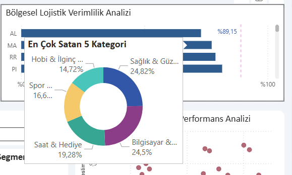
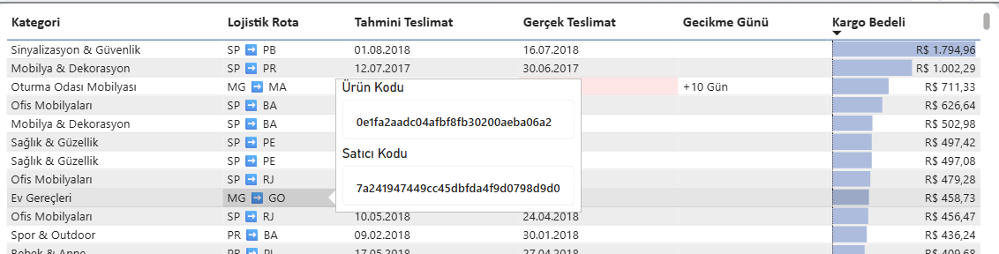

# 📦 Olist E-Commerce & Logistics Analysis Dashboard

## 📊 Proje Hakkında
Bu proje, Brezilya'nın en büyük e-ticaret platformlarından biri olan **Olist**'in 2016-2018 yılları arasındaki **113.000+ satırlık** gerçek sipariş verilerini analiz etmek için geliştirilmiştir. 

Projenin temel amacı sadece satış rakamlarını göstermek değil; **Lojistik Performansı (KPI)**, **Müşteri Kayıp (Churn) Analizi** ve **Teslimat Süreçlerindeki Darboğazları** tespit eden bir Karar Destek Sistemi (DSS) oluşturmaktır.

## 🖼️ Proje Görselleri

### 1. Yönetici Özeti (Executive Dashboard)

*Genel satış performansı, KPI'lar ve sipariş trendleri.*

### 2. Lojistik ve Coğrafi Analiz

*Eyalet bazlı teslimat performansları ve dinamik ısı haritası.*

### 3. Özel Tooltip (UX Geliştirmesi)

*Kullanıcı deneyimini artırmak için tasarlanan, veri üzerinde gezinirken açılan detay pencereleri.*

---

## 🚀 Öne Çıkan Analizler ve Çıkarımlar (Business Insights)

Veri seti üzerinde yapılan derinlemesine analizler sonucunda şu kritik iş zekası çıkarımları yapılmıştır:

* **Müşteri Kaybı (Churn) Eşiği:** Sadık müşterilerde ortalama gecikme süresi **8.7 gün** iken, kaybedilen müşterilerde bu süre **10.5 güne** çıkmaktadır. **10 günlük gecikme**, müşteri sadakati için kritik bir kırılma noktasıdır.
* **Lojistik Verimliliği:** Teslimat sorunlarının %70'i "Farklı Eyalet (Cross-border)" gönderimlerinde yaşanmaktadır. Yerel teslimatlar (Örn: SP -> SP) hedef sürelerin altındadır.
* **Coğrafi Darboğazlar:** Kuzey eyaletlerine (Örn: Amazon bölgesi) yapılan teslimatlarda, kargo maliyetinden ziyade **teslimat süresinin uzunluğu** müşteri memnuniyetsizliğinin ana sebebidir.

## 🛠️ Kullanılan Teknolojiler ve Yöntemler

Bu projede **End-to-End BI (Uçtan Uca İş Zekası)** süreçleri uygulanmıştır:

* **Veri Modelleme:** Star Schema (Yıldız Şema) yapısı kuruldu. `Fact_Sales` tablosu ile `Dim_Customers`, `Dim_Products` vb. tablolar arasında One-to-Many ilişkiler optimize edildi.
* **ETL (Extract, Transform, Load):** Power Query kullanılarak ham verideki tarih formatı hataları, null değerler ve tutarsızlıklar temizlendi.
* **DAX (Data Analysis Expressions):** * Karmaşık zaman zekası fonksiyonları (`Time Intelligence`).
    * Dinamik ölçümler (`USERELATIONSHIP`, `CALCULATE`, `AVERAGEX`).
    * Koşullu biçimlendirme için mantıksal fonksiyonlar.
* **Veri Görselleştirme:**
    * Page Navigation ve Drill-through (Detaylandırma) özellikleri.
    * Custom Tooltip sayfaları.
    * Dinamik Harita (Shape Map & Azure Map) entegrasyonu.

## 📂 Dosya Yapısı
* `Olist_Analysis_Final.pbix`: Power BI Proje Dosyası.
* `Screenshots/`: Proje ekran görüntüleri.
* `Data/`: (Opsiyonel) Kaggle veri seti linki.

## 🔗 Veri Seti
Kullanılan veri seti: [Brazilian E-Commerce Public Dataset by Olist](https://www.kaggle.com/datasets/olistbr/brazilian-ecommerce)

---
**Geliştirici:** Mümine Buran
**LinkedIn:** www.linkedin.com/in/mumineb